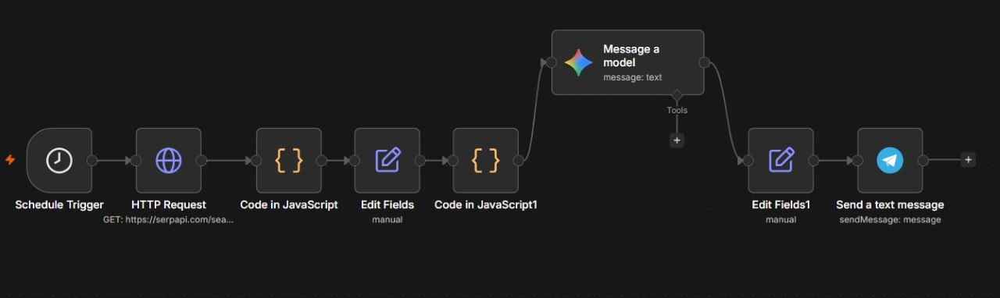
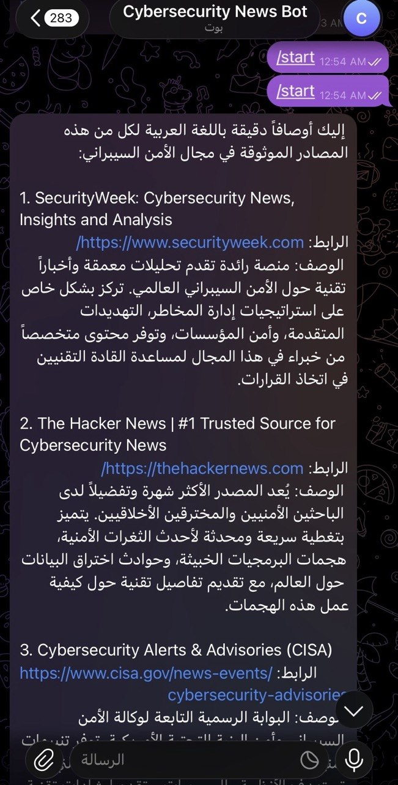

# 🛡️ Cybersecurity News Automation

An automated cybersecurity news workflow built with n8n, SerpApi, Google Gemini, and Telegram.

## 📌 About the Project

This project automatically collects the latest cybersecurity news, processes the results, summarizes the news using AI, and sends the final summaries to a Telegram chat.

The goal is to automate the process of monitoring cybersecurity news and receiving concise updates without manually searching for new articles.

## 📸 Screenshots

### 1. n8n Workflow

The complete automation workflow built using n8n, SerpApi, Google Gemini, and Telegram.



---

### 2. Telegram News Summary

Example of the cybersecurity news summaries automatically delivered to Telegram.



## 🛠️ Technologies

- n8n
- SerpApi
- Google Gemini
- Telegram Bot API
- JavaScript

## 🔄 Workflow

```text
Trigger
   ↓
SerpApi
   ↓
Process & Sort News
   ↓
Google Gemini
   ↓
Telegram
